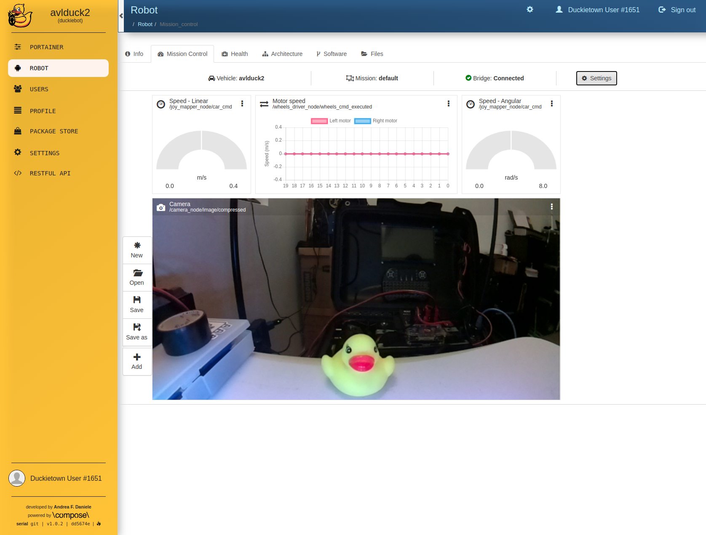

## Project 1 (10% over the final grade) 

### Assigned: September 11, 2021
### Due: September 23, 2021

--------

#### Project 1 with go over Duckiebot Setup, Calibration, and Demonstration

--------
## Please read all instructions in the [duckiebot documentation](https://docs.duckietown.org/DT19/opmanual_duckiebot/out.pdf) carefully.

--------

## Notes:
- The box you received has:
    - the assembled Duckiebot (DB19)
    - battery
    - battery charger (micro usb cable)
    - screwdriver
    - Micro SD Card
    - Micro SD Card USB reader
- If you are using a virtual machine, you probably need to change your networking settings such that you can connect to the Duckiebot. Your adapter should be set to “bridged.” Refer to this documentation to set this correctly.

## Part 1
- Create a duckietown account and choose the [University of South Carolina](https://sc.duckietown.org/sc/sc-roster) following the [documentation](https://docs.duckietown.org/daffy/opmanual_duckiebot/out/dt_account.html)

- Make sure to set dts token using the instruction from the previous step.

## Part 2

### Initialize your duckiebot
- plug the Micro SD Card into the reader and plug that into your computer
- Follow the steps in this [Documentation](https://docs.duckietown.org/daffy/opmanual_duckiebot/out/setup_duckiebot.html) to flash the Micro SD Card.
    - for the hostname, use the hostname your group was assigned. ex: duck39
- Now, follow the instructions to boot duckiebot for the first time:
    - during the first boot, the duckiebot should have internet connection. if you are going the ethernet route, you should Bridge the internet connection through your laptop with Ethernet. Follow 18.4. Option 2 in the [manual](https://docs.duckietown.org/daffy/opmanual_duckiebot/out/duckiebot_network.html)

- once the "status" column on dts fleet discover reads "Ready", take a screenshot and save for later use in submission.

## Part 3
### The dashboard
The duckiebot has several tools to help you debug problems and set up configurations. The dashboard allows you to see basic information about your robot.

- follow the instruction in the [documentation](https://docs.duckietown.org/daffy/opmanual_duckiebot/out/duckiebot_dashboard_setup.html) to set up the dashboard.
- Navigate to the Mission Control tab and take a screenshot similar to this for submission. 

    ** Make sure the screenshot includes the camera feed.

## Part 4
### Let's make the duckiebot move
- Follow the [instructions](https://docs.duckietown.org/daffy/opmanual_duckiebot/out/rc_control.html) to make your robot move.

## Part 5
### Camera Calibration

Calibrate your camera so that your duckiebot can see the world around it. Ensure it is in focus first by twisting the lens while looking at the initial calibration window in the [instructions](https://docs.duckietown.org/daffy/opmanual_duckiebot/out/camera_calib.html) until the image is sharp. 

## Part 6
### Wheel Calibration

Calibrate your wheels so your duckiebot can drive straight. [Instructions](https://docs.duckietown.org/daffy/opmanual_duckiebot/out/wheel_calibration.html)

## Part 7
### Lane Follow Demo

let’s put it all together and start the lane following demo. We’re going to do this by manually starting a docker container on the robot and running each step by hand. 

- The Lab (1D49) has assembled Duckietowns you can use for the step. If you choose to assemble your own duckietown, follow the [instructions](https://docs.duckietown.org/daffy/opmanual_duckietown/out/dt_ops_appearance_specifications.html).

- To start, place your robot in a lane.
- Let’s see what is running on your robot first. In a terminal, run:

        dts start_gui_tools <duckiebot_name>

    When that starts, you will connect to the ROS instance on the Duckiebot and can use debug tools. Run:
        
        rqt_graph
    And you should see a graph of all nodes and topics. Screenshot the most legible image of this graph as you can to turn it in.

- Start keyboard control as in part 4.

        dts duckiebot keyboard_control <duckiebot_name>

- Open a terminal and start the dt-core docker container on the duckiebot:

        docker -H <duckiebot_name>.local run --rm --name test_lane_follow -v /data:/data --network=host -it duckietown/dt-core:daffy-arm32v7 bash
    NOTE: this command is all one line.

    This should start in the directory 
    
        /code/catkin_ws/src/dt-core

- Change directory:

        cd /code/catkin_ws

- Source your environment
    
        source devel/setup.bash
- Run 
    
        catkin build 

- Source your environment again
        
        source devel/setup.bash

- Run
        
        roslaunch duckietown_demos lane_following.launch 
        
    Wait for the messages to stop (You should see health status change to “STARTED” at the end)

- In a start_gui_tools terminal (from earlier) run “rqt_graph” again. What has changed since the last time you ran it? Turn in a screenshot of this graph as well.

- In keyboard control, while selecting the window, press ‘a’. The robot should now move around the track. Press ‘s’ to stop. 

    Note that the robot does not handle intersections in this mode. Ensure that it follows lanes or recalibrate until it does.

    Note that you can also start the demo through dts tools but you will not receive as much feedback [instruction](https://docs.duckietown.org/daffy/opmanual_duckiebot/out/demos.html).

- Demonstrate lane following to your instructor/TA by taking a video and uploading it to youtube. Make sure to follow the instructions below to include a link to the video in your submission.

## Part 8

### Dropbox submission

NOTE: Your submission should consist of only one pdf file

- Submit a PDF to CSE Dropbox with:

    * The name of your duckiebot
    * A youtube link to the video of your best lane following demo run
    * The screenshots:
        - FROM PART 2 (dts fleet discover)
        - FROM PART 3 (dashboard mission control tab)
        - FROM PART 7 (rqt_graph before)
        - FROM PART 7 (rqt_graph after)

    * Write a few sentences about what happens on the robot when you run lane following. Which nodes start, and how are they connected to what was running on the robot before? What do you think each of these new nodes does?

    * pdf format instructions
        * Header with the class code, the semester and year, the homework number, and your name.
          e.g., CSCE 274 Section 1 Fall 2021 – Project 1 – Ibrahim Salman
          
        * Your answers, clearly identifying the answered assignments.

        * The name of the file should be in the following format:
        
            csce274_fall2021_<project#>_<last_name>.pdf
            e.g., csce274_fall2021_project1_salman.pdf

